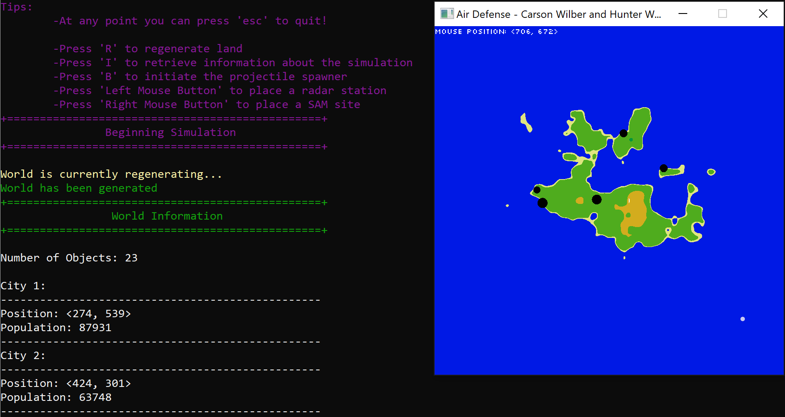
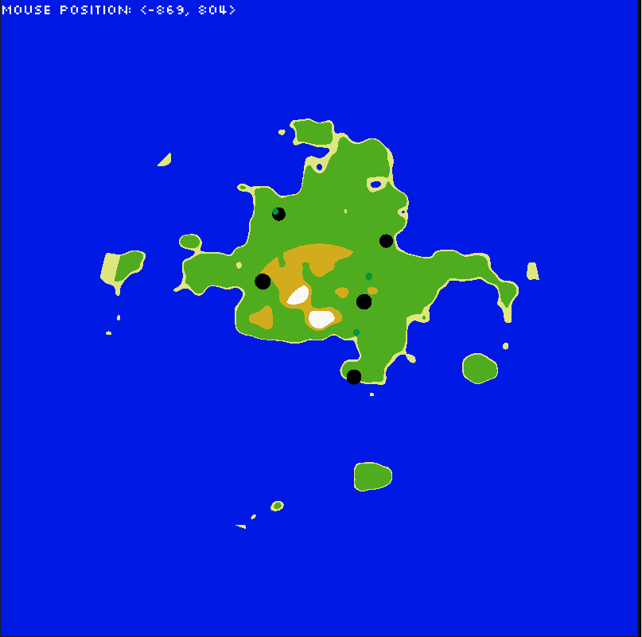
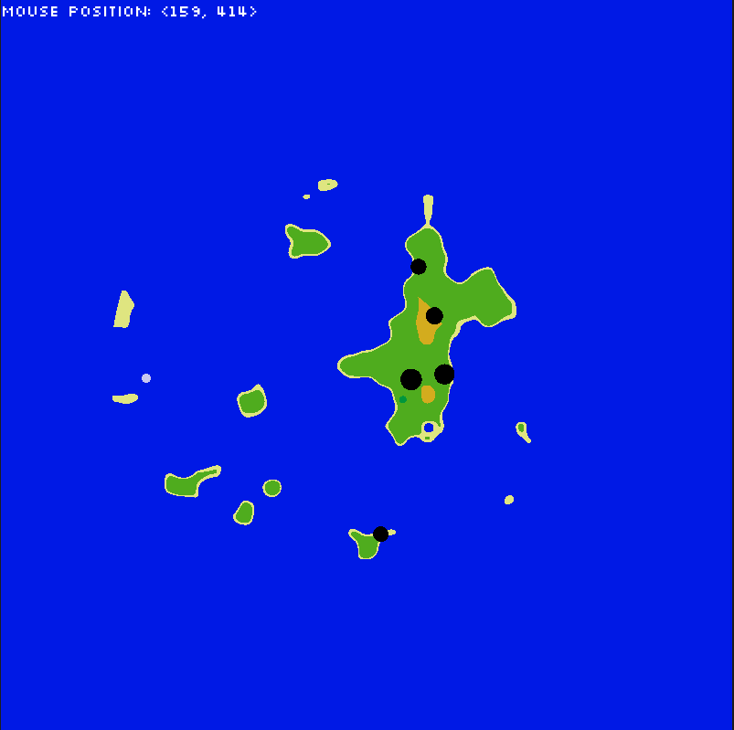
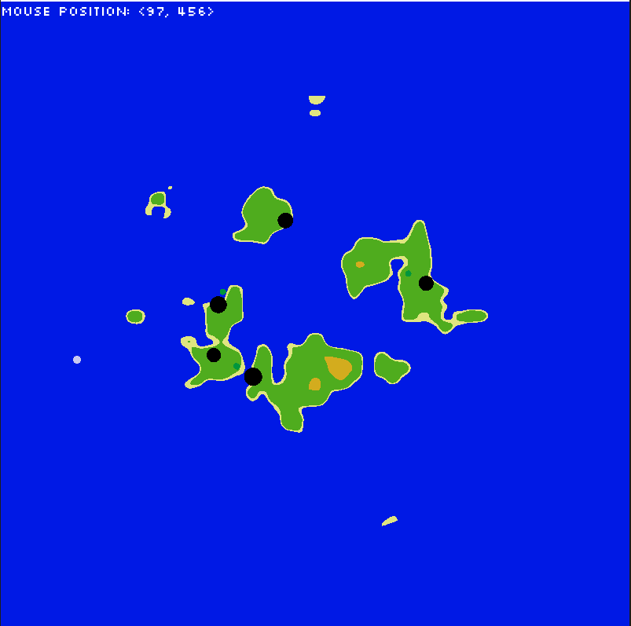
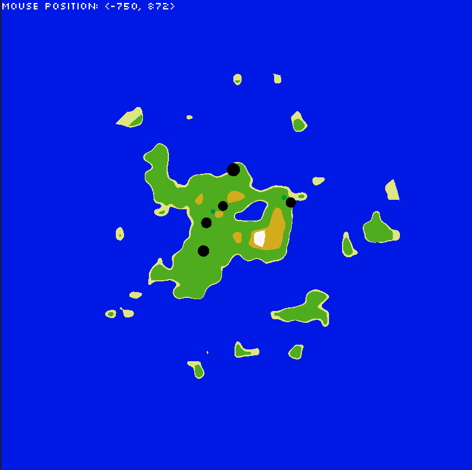
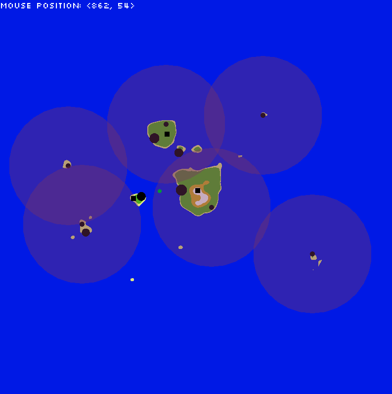

<h4 align="center">A project built to experiment with a neural-network-based AI missile defense system

<!--

-->

</h4>

---

<h4 align="center">Hunter Werenskjold and Carson Wilber</h4>

---

## Purpose

This project was created as a final project for an Artificial Intelligence course in my senior year of university. I completed this project in several sprints with my partner, Carson Wilber, in a little over a month. This project primarily focused on developing a SHORAD defense system AI to protect a randomly generated island country from a missile attack.

The AI must determine possible threats from various flying objects and classify them accordingly. This required us to train an AI off a database of heat signatures to produce a neural network such that forward operating bases could correctly identify all flying objects and classify them internally according to potential threat.

---

## Simulation Steps Overview

There are three main steps to this simulation, I will very briefly cover each of them here. However, if you are curious about an in-depth breakdown of this project I implore you to read the pdf titled "AirDefenseSystemExplained" in the [`master/documentation/`](https://github.com/WerenskjoldH/AI-Driven-Air-Defense-System/blob/master/documentation/ "master/documentation/") folder.

### 1. Landmass Generation

During the landmass generation step, we use a form of Perlin Noise to generate a semi-random two-dimensional heightmap from prime numbers and a random seed. From here we apply a radial blur acting as a descent about the center of the simulation space. This gives us a wide variety of island formations as shown below - parameters can also be tweaked with ease to provide varying results.

The next thing we do is run a genetic algorithm which decides the best city placements across a given number of generations the algorithm is allowed to run.

Visualization is handled by passing the heightmap as a texture to the GPU which then runs a GLSL shader program to, in short, convert the heightmap into a more visually appealing image of a landmass.

The last thing handled in this step is a simple propagation of air traffic between cities. The traveling planes each have their own respective heat signatures based off real-world data. This will come in handy for our neural network to analyze in the `Missile Assault` step.

### 2. Forward Operating Base(FOB) and Surface to Air Missile(SAM) Site Placement

During the placement step, the user must place FOBs and SAM sites across their country to analyze the country's air space and protect all cities during the next step. When the user is finished, they can press the keyboard key `"b"` to begin the enemy missile assault.

### 3. Missile Assault

The missiles begin entering the simulation space from the borders targetting various cities. At this point it is up to our Defense AI to analyze all objects in the air space then decypher and classify all potential threats. Those deemed to be critical threats are then flagged for our SAM sites to launch countermeasures against and deactivate before they make contact with any of the country's cities.

I think it's safe to say this part is the most stressful to watch...

---

## How To Use

1. Clone this repository
2. Link SFML 2.5 API from the [Dependables](https://github.com/WerenskjoldH/AI-Driven-Air-Defense-System/tree/master/AirDefense/Dependables) folder assuming you are using 64-bit Windows/Visual C++ 15. This inclusion is more of a relic from development being across several systems all conveniently using the same build target settings. None the less, you can download your respective library builds [HERE](https://www.sfml-dev.org/download/sfml/2.5.1/) from the official SFML website.
3. Build the project, yay!
4. The console should display all relevant keybinds to run the simulation.

---

## Dependencies

This project was built using the [SFML 2.5 API](https://www.sfml-dev.org/)

For the shaders to be able to run you will need a GPU and drivers that support OpenGL 3.5 or greater.

---

## Q&A

### _Q_: I compiled and built the project, but when I tried to run it I got **x** error! What happened?!?

**A**: If you are using Visual Studios, I suggest ensuring all dependent files have been included as well as the proper .dlls for your target system build. Then off these steps:

1. Ensure you linked the proper SFML 2.5 libraries. (x64/x86)
2. Ensure you aren't linking SFML Release libs to a Debug build, or vice versa.
3. Ensure the folders `Fonts` and `Shaders` present, if not, add them. The `Shaders` folder missing is almost always the issue if you get a "ERROR::SHADER::[...]" notification in the console.
4. Ensure the file `model.nnet` is present in the build directory?

If you still have an issue, please contact me at Rilliden@gmail.com, I'm always happy to help!

### _Q_: Why are the colours so wack?

**A**: I should have used a proper palette, I know. However, if you want to change it, I have some `#define`s in the [geography.frag](https://github.com/WerenskjoldH/AI-Driven-Air-Defense-System/tree/master/AirDefense/Shaders/geography.frag) to set the land colours to anything you can dream of.

###
